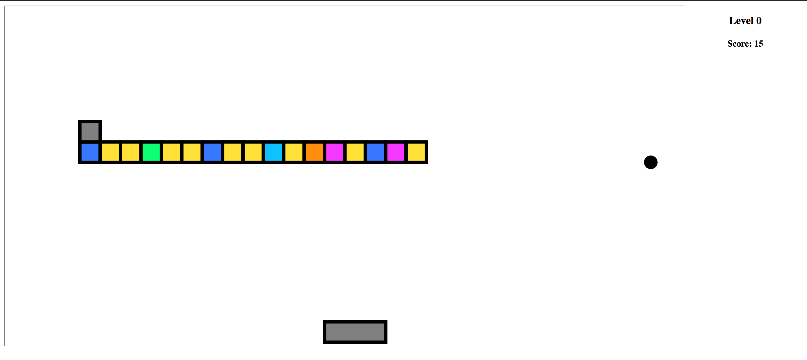

# Brick Breaker

## Play Now
* The `master` branch is always deployed to [GitHub Pages](https://bruts002.github.io/brick-breaker/) with CircleCI.
* Branches starting with `feature/` are all deployed to [AWS S3](http://brick-breaker-staging.s3-website.us-east-2.amazonaws.com/feature/) continually, also with CircleCI.

## About
This game is built using Vanilla Typescript. I use this project as a playground where I can deepen my understanding of
* TypeScript
* JavaScript
* WebPack
* Build Scripts
* Continous Integration
* Continous Delivery

